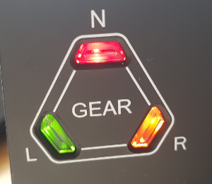
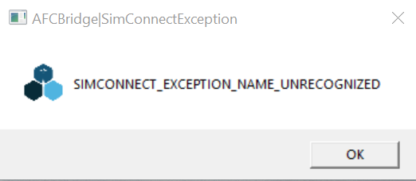
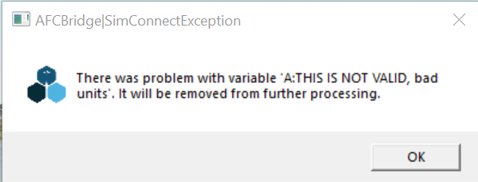

# Honeycomb Bravo Throttle Lights with Microsoft Flight Simulator 2020 (MSFS)

Disclaimer: I am not associated with Honeycomb, the makers of the Bravo, in any way. I've discovered this information purely via trial and error and so I can take no responsibility for errors or omissions or what happens if you make use of this information. Use at your own risk!

---
Here's how the lights on the Bravo (seem to) work:

## AFC_Bridge

The `AFC_Bridge.exe` program installed by the Honeycomb driver installer reads flight status data from the simulator roughly every second and then updates the lights. The `BFC_Throttle_Config.json` file controls how the AFC_Bridge maps values in the simulator (such as whether gear is up, autopilot is enabled and so on) to the lights.

The AFC_Bridge is typically found in the MSFS `Community` folder, under `AFC_Bridge\bin`. In that folder you'll find `AFC_Bridge.exe` together with the configuration file for the Bravo: `BFC_Throttle_Config.json`.

> The `Community` folder can be found in `%LOCALAPPDATA%\Packages\Microsoft.FlightSimulator_8wekyb3d8bbwe\LocalCache\Packages\` for Windows Store installations, `%LOCALAPPDATA%\Packages\Microsoft.FlightDashboard_8wekyb3d8bbwe\LocalCache\Packages\` for Steam installations, or elsewhere (e.g. `C:\FSData\Community` if you have specified a custom location)

The Honeycomb installer automatically configures MSFS to run `AFC_Bridge.exe` when it starts up via an entry in `exe.xml` in the `LocalCache` folder

## Addressing the lights

Each light has a two-part address consisting of a 'ByteIndex' and a 'BitIndex'. There are 8 bits in each byte, numbered 0-7, and a total of 4 bits.

For example, the `ALT` autopilot button light is at byte 1, bit 4 and the `DOOR` annunciator light is at byte 4, bit 3.

## Configuration file

The AFC bridge is controlled by the `BFC_Throttle_Config.json` JSON file which consists of entries that map each light to a set of conditions based on simulator values.

For instance, a configuration entry such as

```json
{
  "ByteIndex": 1,
  "BitIndex": 4,
  "Condition": "A:AUTOPILOT ALTITUDE LOCK, bool",
  "ConditionValue": "=1"
},
```

tells AFC "The LED at byte 1 bit 4 (the 'ALT' autopilot light) should be on if the `AUTOPILOT ALTITUDE LOCK` variable is set to `1` (i.e. if the auto pilot 'ALT' mode is on), otherwise it should be off".

## Making configuration changes

The contents of the `BFC_Throttle_Config.json` file are read by `AFC_Bridge` when a flight starts, so you can edit the file, restart your flight and your new configuration will be applied.  You don't need to restart the simulator.

# LED addresses

Here are the addresses of the lights on the Bravo:

| Byte | Bit | Role |
|-|-|-|
| 1 | 0 | `HDG` button light |
| 1 | 1 | `NAV` button light |
| 1 | 2 | `APR` button light |
| 1 | 3 | `REV` button light |
| 1 | 4 | `ALT` button light |
| 1 | 5 | `VS` button light |
| 1 | 6 | `IAS` button light |
| 1 | 7 | `AUTO PILOT` button light |
| 2 | 0 | Left Gear green light |
| 2 | 1 | Left Gear red light |
| 2 | 2 | Centre Gear green light|
| 2 | 3 | Centre Gear red light |
| 2 | 4 | Right Gear green light |
| 2 | 5 | Right Gear red light |
| 2 | 6 | `MASTER WARNING` annunciator light |
| 2 | 7 | `ENGINE FIRE` annunciator light |
| 3 | 0 | `LOW OIL PRESSURE` annunciator light |
| 3 | 1 | `LOW FUEL PRESSURE` annunciator light |
| 3 | 2 | `ANTI ICE` annunciator light |
| 3 | 3 | `STARTER ENGAGED` annunciator light |
| 3 | 4 | `APU` annunciator light |
| 3 | 5 | `MASTER CAUTION` annunciator light |
| 3 | 6 | `VACUUM` annunciator light |
| 3 | 7 | `LOW HYD PRESSURE` annunciator light |
| 4 | 0 | `AUX FUEL PUMP` annunciator light |
| 4 | 1 | `PARKING BRAKE` annunciator light |
| 4 | 2 | `LOW VOLTS` annunciator light |
| 4 | 3 | `DOOR` annunciator light |

## Amber gear lights

Note that in theory you can show both the red and green light simultaneously for each gear position, producing an amber light. I don't know whether that's officially supported; it's _possible_ that, depending on the circuitry (e.g. if the two LEDs shared a current-limit resistor), that _could_ shorten the life of one or both of those LEDs, or it might be _completely_ fine. Remember that disclaimer at the top of the page?!



# Complex conditions

As well as directly mapping a _single_ simulator variable condition to an LED, the configuration file supports combining conditions using `AND` (represented as `&&`) and `OR` (represented as `||`). Instead of using `Condition` and `ConditionValue`, we use `ConditionLogic` and `Conditions`. For example:

```json
{
  "ByteIndex": 2,
  "BitIndex": 1,
  "ConditionLogic": "&&",
  "Conditions": [
    {
        "Condition": "A:GEAR LEFT POSITION, percent over 100",
        "ConditionValue": "<1"
    },
    {
        "Condition": "A:GEAR LEFT POSITION, percent over 100",
        "ConditionValue": ">0"
    }
  ]
},
```
says
"The LED at byte 2 bit 1 (the left gear red light) should be on if a) the `GEAR LEFT POSITION` value is less than 1 AND b) the `GEAR LEFT POSITION` value is greater than 0, otherwise it should be off."
This turns the left gear light red if the gear is somewhere between 0 and 1, i.e. if it is _partially_ down.

## Specifying simulator variables

There are many hundreds of SimConnect simulator variables, the list of which changes over time.  This is a useful list of the known variables:

* https://docs.flightsimulator.com/html/Programming_Tools/SimConnect/Status/Status_Of_Simulation_Variables.htm

Note that when you specify the name of a variable in the configuration file, it's followed by a comma and a piece of text indicating the units.

### Examples

* `ENG ON FIRE:1, bool`
* `A:ELECTRICAL MAIN BUS VOLTAGE, volts`
* `A:ELECTRICAL MAIN BUS AMPS, amperes`
* `A:AUTOPILOT MASTER, percent over 100`

If an entry is not valid, you'll see errors when you start your flight:




# Examples

Here are some examples of things you could do to the configuration file:

## Multi-engine fire annunciation

The default mapping for the `ENGINE FIRE` light is as follows:

```json
{
  "ByteIndex": 2,
  "BitIndex": 7,
  "Condition": "A:ENG ON FIRE:1, bool",
  "ConditionValue": "=1"
}
```
This says: "The LED at byte 2 bit 7 (the `ENGINE FIRE` annunciator) should be on if the `ENG ON FIRE:1` value is equal to 1, otherwise it should be off."  This turns the `ENGINE FIRE` annunciator light on if there's a fire on engine 1, otherwise it's off.

If instead you want the `ENGINE FIRE` annunciator light to light up if there's a fire on _any_ of your 4 engines, we can replace it with an `OR`ed condition that says "It should be on if engine 1 is on fire OR if engine 2 is on fire OR ...":

```json
{
  "ByteIndex": 3,
  "BitIndex": 0,
  "ConditionLogic": "||",
  "Conditions": [
    {
      "Condition": "A:ENG ON FIRE:1, bool",
      "ConditionValue": "=1"
	},
	{
      "Condition": "A:ENG ON FIRE:2, bool",
      "ConditionValue": "=1"
    },
    {
      "Condition": "A:ENG ON FIRE:3, bool",
      "ConditionValue": "=1"
    },
    {
      "Condition": "A:ENG ON FIRE:4, bool",
      "ConditionValue": "=1"
    }
  ]
}
```

## Fix the Low volts indicator

The standard mapping for the `LOW VOLTS` light is:

```json
{
  "ByteIndex": 4,
  "BitIndex": 2,
  "Condition": "A:ELECTRICAL MAIN BUS AMPS, amperes",
  "ConditionValue": "=0"
}
```

There are two problems with this:
1. It's checking the AMPS, not the VOLTS. There's obviously a relationship.
2. It's only turning the light on when the AMPS value is _exactly_ `0`.  Inspection of the actual variable value shows it at around `-4` for an idle throttle and an alternator on, and `-45` for alternator off.  Using `ELECTRICAL MAIN BUS VOLTAGE` instead we see around 23V for alternator off and 28V for alternator on.  So a better definition of a condition for `LOW VOLTS` would be checking for that variable being less than, say, 26V.

So we replace the above with:

```json
{
  "ByteIndex": 4,
  "BitIndex": 2,
  "Condition": "A:ELECTRICAL MAIN BUS VOLTAGE, volts",
  "ConditionValue": "<26"
}
```

